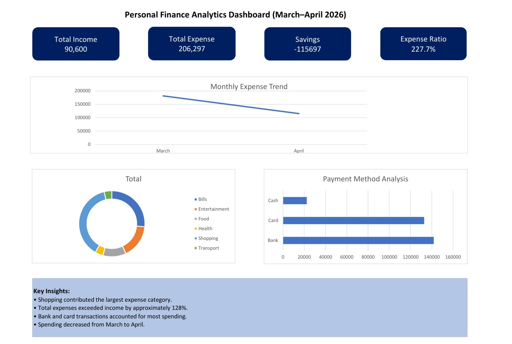

# Personal Finance Analytics Dashboard (Excel)

## Overview
This project is an interactive Excel dashboard created to analyze personal financial transactions and generate insights on spending behavior, income patterns, and payment methods.

## Features
- Data cleaning and preprocessing
- Pivot Table analysis
- Interactive dashboard
- KPI cards
- Trend analysis
- Expense categorization
- Financial insights

## Tools Used
- Microsoft Excel
- Pivot Tables
- Pivot Charts
- Slicers
- Data Validation
- Dashboard Design

## Dashboard Preview



## Key Insights
- Shopping contributed the highest expense category
- Expenses exceeded income by approximately 128%
- Bank and card transactions dominated payments
- Spending decreased from March to April

## Project Structure

```text
Transactions
Cleaned_Data
Analysis
Dashboard
```

## Author
Janeesha Dewmini
